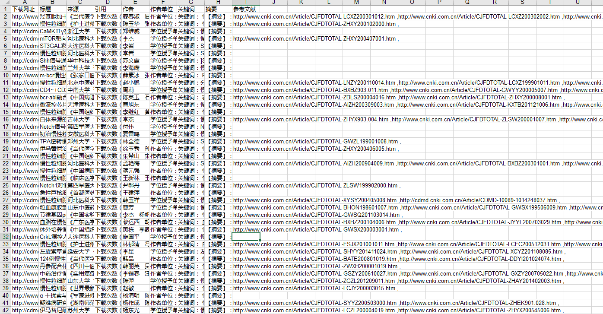

# CNKICrawler
# 中国知网爬虫
## 可以爬取文章的全部信息,包括文章名、作者、作者单位、被引用次数、下载次数、文章来源、文章关键词、文章摘要、文章参考文献，文章详情页面url
## 需要安装的工具有：BeautifulSoup， xlwt

### 使用python3.x
### 运行spider_main.py即可，生成的结果文件为：data_out.xls，配置文件为Config.conf

运行结果：

在线演示：http://www.qiuqingyu.cn/todolist/

项目网址：http://www.qiuqingyu.cn/2017/04/27/python%E5%AE%9E%E7%8E%B0CNKI%E7%9F%A5%E7%BD%91%E7%88%AC%E8%99%AB/
